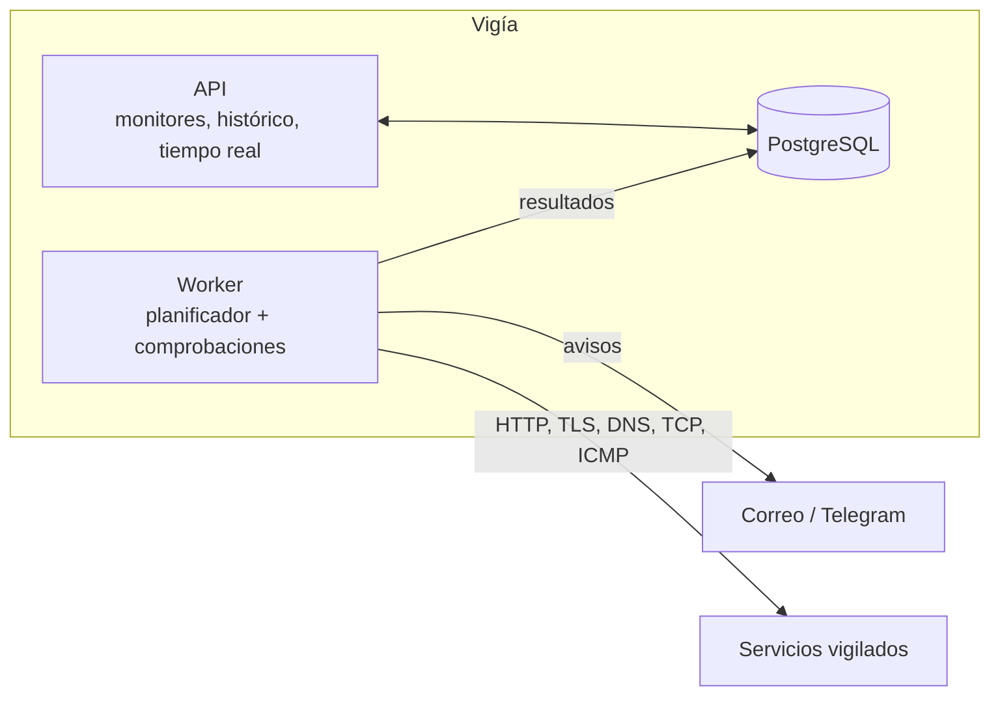

# Vigía

Monitor de servicios e infraestructura, autoalojado. Vigila webs y servicios (disponibilidad,
latencia, certificados TLS, DNS y puertos), guarda el histórico, abre incidentes y avisa por
correo y Telegram. Tiene un panel en tiempo real y una página de estado pública.

> En construcción. Ahora mismo está el esqueleto: solución por capas, entorno local con
> .NET Aspire (PostgreSQL y Mailpit), comprobaciones de salud y tests de arquitectura.

## Cómo está pensado



El worker va separado de la API para que las comprobaciones sigan funcionando aunque la API se
reinicie o se despliegue. Las dependencias entre proyectos van siempre hacia dentro y un proyecto de
tests las comprueba.

## Cómo ejecutarlo

Requiere el SDK de .NET 10 y Docker.

```bash
dotnet run --project src/Vigia.AppHost     # PostgreSQL + Mailpit + API + worker, con el panel de Aspire
```

Cada proyecto de `tests/` es un ejecutable:

```bash
for proyecto in tests/*.Tests/; do dotnet run --project "$proyecto" || break; done
```

## Estructura

```
src/
  Vigia.Dominio/          monitores, máquina de estados, disponibilidad (sin dependencias)
  Vigia.Comprobaciones/   HTTP, TLS, DNS, TCP e ICMP, y la protección contra SSRF
  Vigia.Datos/            EF Core y SQL de particiones y agregados
  Vigia.Worker/           planificador, ejecución, avisos, agregación y retención
  Vigia.Api/              endpoints y tiempo real
  Vigia.AppHost/          entorno local con .NET Aspire
  Vigia.ServiceDefaults/  observabilidad, health checks y resiliencia
tests/                    dominio, arquitectura y API
```

## Licencia

[MIT](LICENSE)
