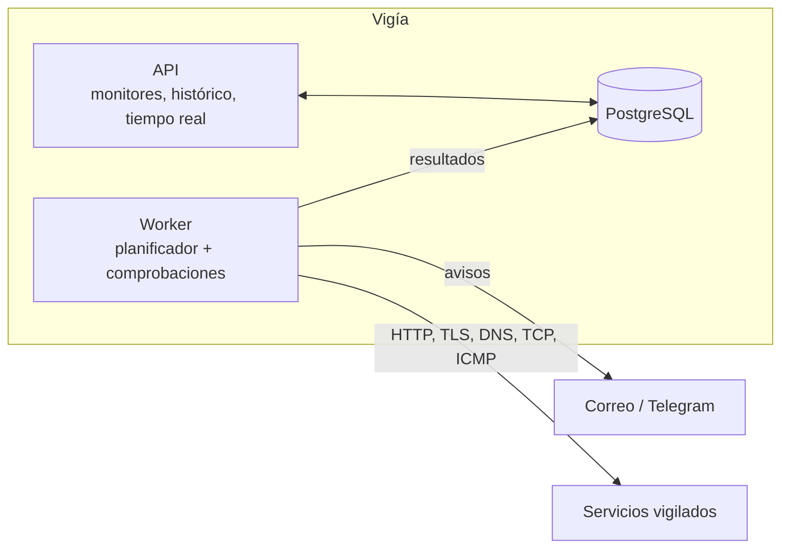
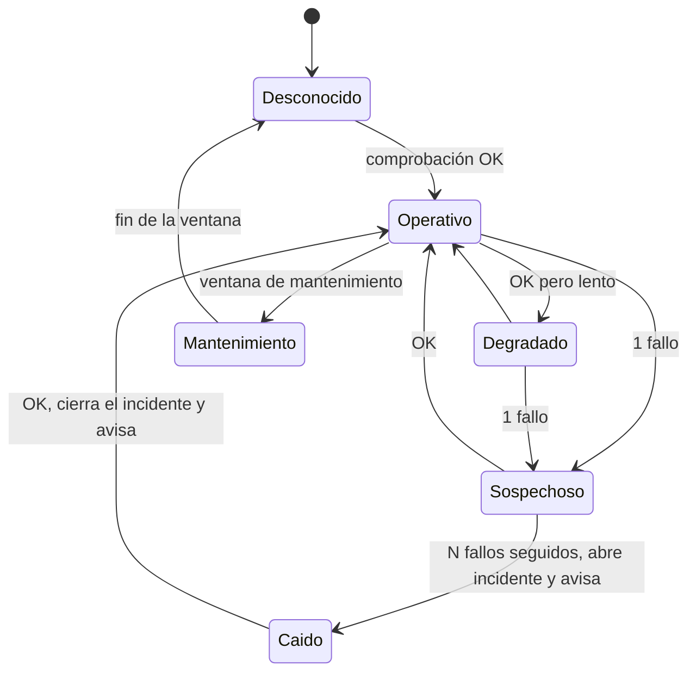

# Vigía

Monitor de servicios e infraestructura, autoalojado. Vigila webs y servicios (disponibilidad,
latencia, certificados TLS, DNS y puertos), guarda el histórico, abre incidentes y avisa por
correo y Telegram. Tiene un panel en tiempo real y una página de estado pública.

> En construcción. Hechos: el esqueleto (solución por capas y entorno local con .NET Aspire), las
> comprobaciones de red con su protección contra SSRF, la máquina de estados, la persistencia y el
> planificador del worker y los avisos por correo y Telegram. Faltan la API y el panel.

## Cómo está pensado



El worker va separado de la API para que las comprobaciones sigan funcionando aunque la API se
reinicie o se despliegue. Las dependencias entre proyectos van siempre hacia dentro y un proyecto de
tests las comprueba.

## Las comprobaciones

| Tipo | Qué comprueba |
|---|---|
| **HTTP(S)** | Código esperado, palabra clave en la respuesta, redirecciones y tiempos de DNS y de conexión |
| **TLS** | Días hasta la caducidad del certificado, emisor y protocolo |
| **DNS** | Que un nombre resuelve, y a lo esperado (A, AAAA, CNAME, MX, TXT), preguntando a un servidor concreto |
| **TCP** | Que un puerto acepta conexiones |
| **ICMP** | Que un equipo responde al ping |

Cada comprobación tiene un tiempo máximo que la corta y cuenta como fallo, y devuelve siempre un
resultado (nunca lanza por un fallo del destino).

**Una herramienta que hace peticiones a direcciones escritas por personas es un caso de manual de
SSRF.** Una única guardia decide a qué se puede conectar: resuelve el nombre una sola vez y conecta a la
dirección ya validada (así el DNS no puede contestar otra cosa al conectar), bloquea los rangos internos
y los metadatos de las nubes (también escritos como IPv6 o como número), valida cada redirección y solo
admite `http` y `https`. Está explicado en el [ADR 0002](docs/adr/0002-proteccion-contra-ssrf.md).

## Estados, incidentes y disponibilidad

Cada comprobación alimenta una máquina de estados (código puro de dominio, probado con secuencias de
resultados y con diez mil secuencias aleatorias):



- **Un fallo aislado no avisa:** hacen falta N fallos seguidos (3 por defecto) para dar un servicio por caído.
- **Un aviso por transición:** una caída y una recuperación por incidente, sin repeticiones.
- **El mantenimiento no cuenta:** ni abre incidentes ni avisa ni entra en la disponibilidad.

La disponibilidad se calcula sobre el tiempo pasado en cada estado:

```
disponibilidad = tiempo en pie / (tiempo en pie + tiempo caído)
```

El mantenimiento y el tiempo sin datos quedan fuera, y el porcentaje se trunca, no se redondea hacia
arriba (99,9996 % se enseña como 99,99 %, nunca como 100 %). Para 30 días, el 99,9 % permite 43
minutos y 12 segundos de caída. Todo está razonado en el [ADR 0003](docs/adr/0003-maquina-de-estados-y-disponibilidad.md).

## Los datos y el planificador

Un monitor de un minuto genera 1.440 filas al día, y con cientos de monitores son cientos de millones al
año. Por eso los resultados se guardan **en una tabla particionada por mes**: la retención (14 días de
detalle) es un `DROP TABLE` instantáneo y no un `DELETE` de millones de filas, y las consultas por fecha
solo leen el mes que necesitan. Encima hay agregados por hora (90 días) y por día (siempre) calculados con
la misma definición de disponibilidad que el resto del programa.

El planificador reparte las comprobaciones con una cola de prioridad: no solapa dos comprobaciones del mismo
monitor, mantiene el ritmo sin hacer ráfagas, dispersa las primeras para que no se lancen todas a la vez y
limita cuántas corren simultáneamente. Un fallo se repite una vez antes de contarlo, y los cambios de
configuración le llegan al instante por `LISTEN/NOTIFY` de PostgreSQL. Se prueba con una simulación de 50
monitores durante una hora en segundos, con reloj simulado. Todo en el
[ADR 0004](docs/adr/0004-datos-particionados-y-planificador.md).

## Avisos

Cuando un servicio cae (N fallos seguidos) se avisa **una vez**, y cuando se recupera, **otra**. Los avisos se
guardan en la base de datos **en la misma transacción que el incidente** y un proceso aparte los envía con
reintentos espaciados (bandeja de salida): no hay caída sin aviso ni aviso de algo que no pasó, un canal
caído no pierde el mensaje y un índice único de la base de datos impide duplicados aunque haya reinicios o
varias instancias. Todo razonado en el [ADR 0005](docs/adr/0005-avisos-con-bandeja-de-salida.md).

Se configuran por variables de entorno (o el gestor de secretos; nunca en ficheros del repositorio):

| Variable | Qué es |
|---|---|
| `Correo__Servidor`, `Correo__Puerto`, `Correo__Remitente`, `Correo__UsarTls`, `Correo__Usuario`, `Correo__Contrasena` | El servidor SMTP |
| `Avisos__Destinatarios__0`, `__1`… | A quién se escribe por correo |
| `Avisos__TokenTelegram` | El token del bot (se crea con @BotFather) |
| `Avisos__ChatsTelegram__0`, `__1`… | Los chats a los que avisa el bot |

Un canal solo se usa si está completo (destinatarios y servidor, o chats y token). En local, el entorno de
Aspire manda los correos a Mailpit (<http://localhost:8026>).

## Cómo ejecutarlo

Requiere el SDK de .NET 10 y Docker.

```bash
dotnet run --project src/Vigia.AppHost     # PostgreSQL + Mailpit + API + worker, con el panel de Aspire
```

Cada proyecto de `tests/` es un ejecutable:

```bash
for proyecto in tests/*.Tests/; do dotnet run --project "$proyecto" || break; done
```

## Estructura

```
src/
  Vigia.Dominio/          monitores, máquina de estados, disponibilidad (sin dependencias)
  Vigia.Comprobaciones/   HTTP, TLS, DNS, TCP e ICMP, y la protección contra SSRF
  Vigia.Datos/            EF Core y SQL de particiones y agregados
  Vigia.Worker/           planificador, ejecución, avisos, agregación y retención
  Vigia.Api/              endpoints y tiempo real
  Vigia.AppHost/          entorno local con .NET Aspire
  Vigia.ServiceDefaults/  observabilidad, health checks y resiliencia
tests/                    dominio, comprobaciones (con servidores reales en local), datos y worker
                          (con PostgreSQL real en contenedor), arquitectura y API
```

## Licencia

[MIT](LICENSE)
