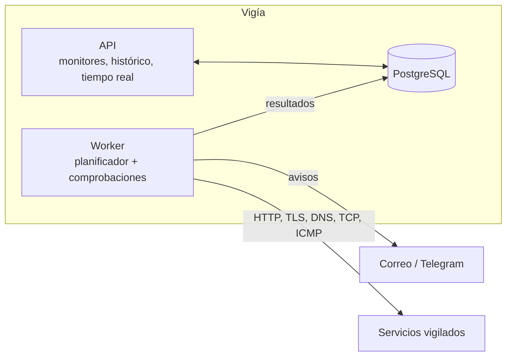

# Vigía

Monitor de servicios e infraestructura, autoalojado. Vigila webs y servicios (disponibilidad,
latencia, certificados TLS, DNS y puertos), guarda el histórico, abre incidentes y avisa por
correo y Telegram. Tiene un panel en tiempo real y una página de estado pública.

> En construcción. Hechos: el esqueleto (solución por capas y entorno local con .NET Aspire) y las
> comprobaciones de red con su protección contra SSRF. Faltan el dominio de incidentes, el planificador,
> los avisos, la API y el panel.

## Cómo está pensado



El worker va separado de la API para que las comprobaciones sigan funcionando aunque la API se
reinicie o se despliegue. Las dependencias entre proyectos van siempre hacia dentro y un proyecto de
tests las comprueba.

## Las comprobaciones

| Tipo | Qué comprueba |
|---|---|
| **HTTP(S)** | Código esperado, palabra clave en la respuesta, redirecciones y tiempos de DNS y de conexión |
| **TLS** | Días hasta la caducidad del certificado, emisor y protocolo |
| **DNS** | Que un nombre resuelve, y a lo esperado (A, AAAA, CNAME, MX, TXT), preguntando a un servidor concreto |
| **TCP** | Que un puerto acepta conexiones |
| **ICMP** | Que un equipo responde al ping |

Cada comprobación tiene un tiempo máximo que la corta y cuenta como fallo, y devuelve siempre un
resultado (nunca lanza por un fallo del destino).

**Una herramienta que hace peticiones a direcciones escritas por personas es un caso de manual de
SSRF.** Una única guardia decide a qué se puede conectar: resuelve el nombre una sola vez y conecta a la
dirección ya validada (así el DNS no puede contestar otra cosa al conectar), bloquea los rangos internos
y los metadatos de las nubes (también escritos como IPv6 o como número), valida cada redirección y solo
admite `http` y `https`. Está explicado en el [ADR 0002](docs/adr/0002-proteccion-contra-ssrf.md).

## Cómo ejecutarlo

Requiere el SDK de .NET 10 y Docker.

```bash
dotnet run --project src/Vigia.AppHost     # PostgreSQL + Mailpit + API + worker, con el panel de Aspire
```

Cada proyecto de `tests/` es un ejecutable:

```bash
for proyecto in tests/*.Tests/; do dotnet run --project "$proyecto" || break; done
```

## Estructura

```
src/
  Vigia.Dominio/          monitores, máquina de estados, disponibilidad (sin dependencias)
  Vigia.Comprobaciones/   HTTP, TLS, DNS, TCP e ICMP, y la protección contra SSRF
  Vigia.Datos/            EF Core y SQL de particiones y agregados
  Vigia.Worker/           planificador, ejecución, avisos, agregación y retención
  Vigia.Api/              endpoints y tiempo real
  Vigia.AppHost/          entorno local con .NET Aspire
  Vigia.ServiceDefaults/  observabilidad, health checks y resiliencia
tests/                    dominio, comprobaciones (con servidores reales en local), arquitectura y API
```

## Licencia

[MIT](LICENSE)
